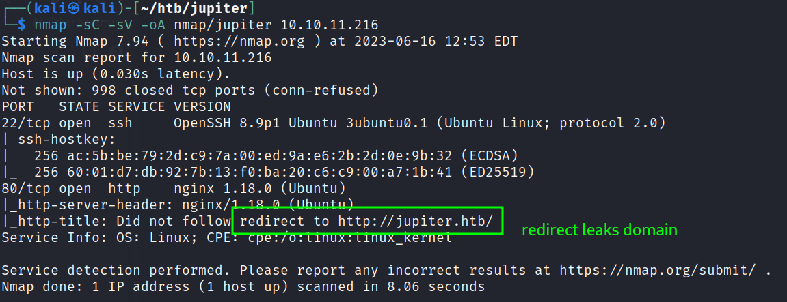

# Enumeration

## TCP services - common

```bash
nmap -sC -sV -oA nmap/jupiter 10.10.11.216 # scan for top 1000 default ports
```



An `nmap` scan of the 1000 most common TCP ports reveals a web server running on Port 80, with a leaked domain name of `jupiter.htb`.  See  Figure \ref{myLabel}
