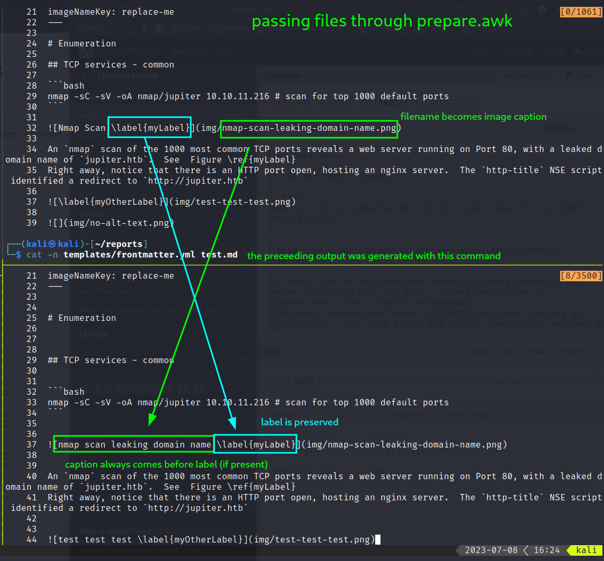
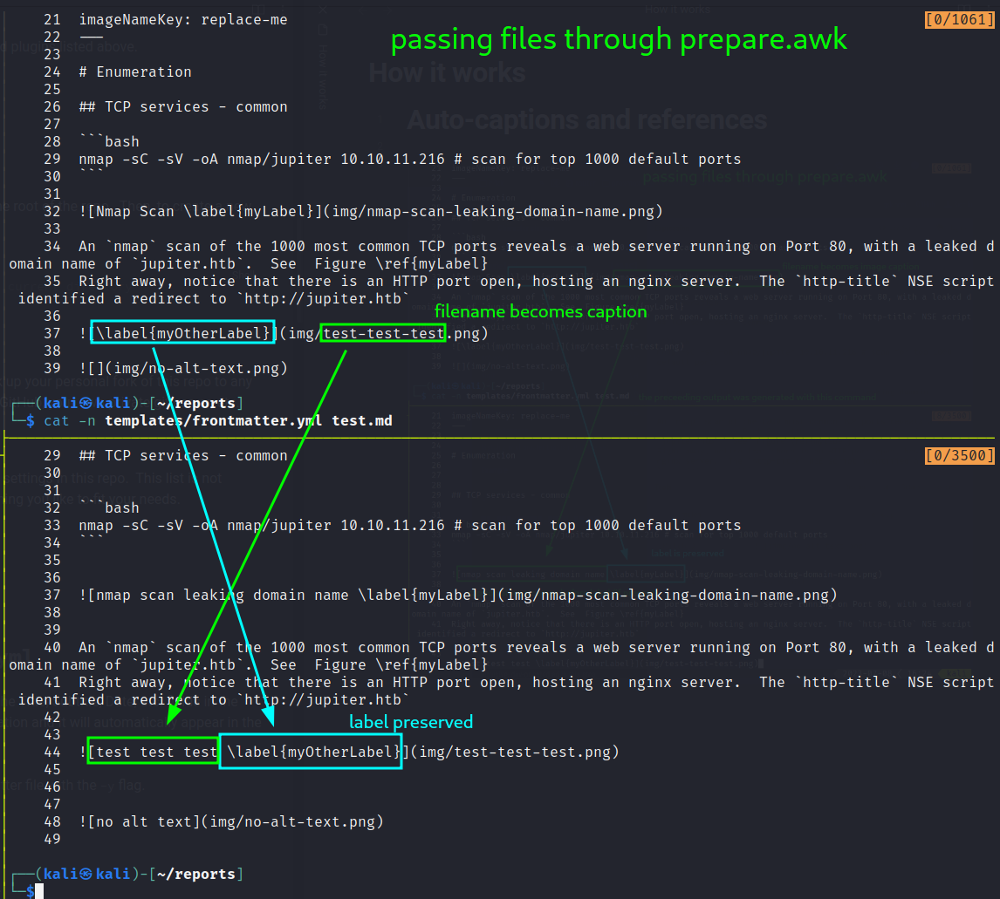
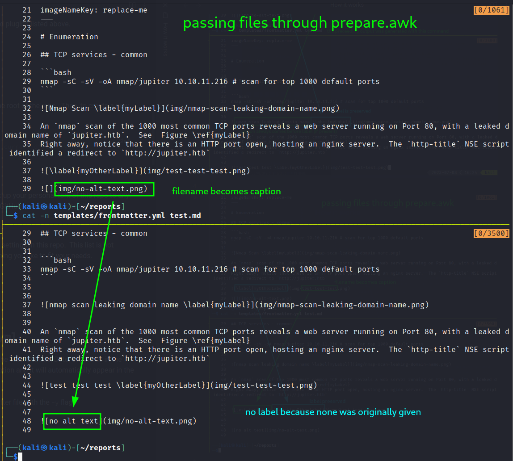

# Preparing your documents
In `generate.sh`, the command immediately before the call to Pandoc is `awk -f prepare.awk`.  It is the output of this script which is rendered to the final report, and this script is responsible for ensuring that a single strict requirement is met: image links and lines containing headers should not be preceded or followed immediately by text. For example,

This indirect rendering has the beneficial side effect of leaving your original files intact.

# Auto-captions and references
The three images shown below examine the same output for three different use cases for auto captions and labels.

In each of the images the original, untouched input files appear on the top split, and the output of `prepare.awk` is shown in the bottom split.  Lines 1-22 are the same in each split.

## filenames become captions, labels are preserved, prior alt-text remains in original files

## anything not a filename or a label is ignored

## filename will always become caption
