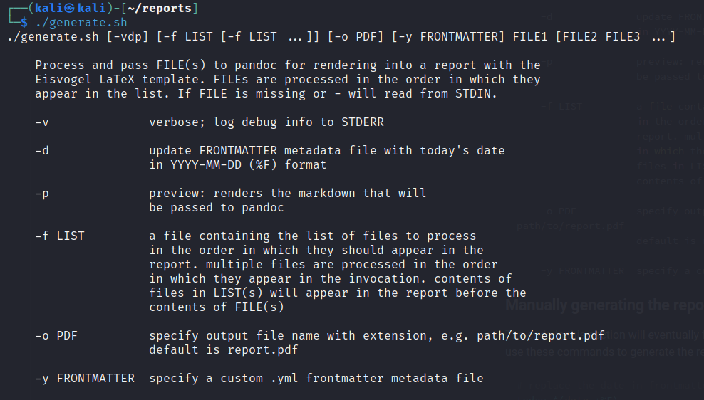
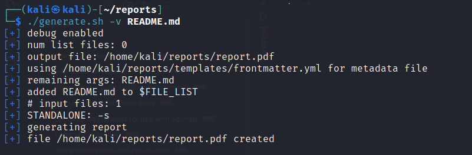

# Overview
This is a fork of [noraj/OSCP-Exam-Report-Template-Markdown](https://github.com/noraj/OSCP-Exam-Report-Template-Markdown). 

The goal is to help streamline report writing during labs/pentesting, by reducing the number of "passes" needed to create the report.  

The idea is that you can take your notes organically during the test, and with some minimal editing, quickly assemble your text into a clean, professional looking report with 

* an automatically generated title page
* an automatically generated table of contents
* automatically generated image labels
* automatically generated references to figures within the document
* automatically generated chapter/heading/section/subsection numbers

This project makes use of the [Obsidian Markdown Editor](https://obsidian.md),  [The Eisvogel LaTeX template](https://github.com/Wandmalfarbe/pandoc-latex-template#installation),  [`pandoc`](https://pandoc.org/installing.html), and some custom scripts to help save you time writing reports.

## Intent
The intent for this repo is for it to be used as a "starter" for reporting on tests, labs, etc.  This was designed for the Obsidian Markdown editor in order to take advantage of some of the native features as well as community plugins.

The `.obsidian` folder is included in this repo, so you should have all the plugins and settings enabled from the get-go.  Please make whatever adjustments you need to work comfortably.

# Requirements
## Important Note

This is intended for use only on Linux.  I have not tested this on Windows, and I am not planning to any time soon.  If you'd like to be a guinea pig, feel free to fork and submit a pull request!

## Software
- [Obsidian Markdown Editor](https://obsidian.md) , with the following plugins:
    * Paste image rename plugin (included in this repo)
    * Obsidian Link Converter plugin (included in this repo)
    * Obsidian Heading Shifter plugin (included in this repo)
- [`pandoc`](https://pandoc.org/installing.html)
- [The Eisvogel LaTeX template](https://github.com/Wandmalfarbe/pandoc-latex-template#installation)
* LaTeX/TeXlive - see below
* `awk` - should come standard with Linux distro

### Obsidian plugin breakdown

| plugin name | what it does | why it's needed | 
| --- | --- | --- |
| Paste Image Rename | Renames images as they're pasted into the project. | better attachment organization; image filenames become captions in report |
| Obsidian Link Converter | ensures links are CommonMark markdown spec with relative paths | Pandoc only recognizes CommonMark link formats. Also makes it trivially easy to convert older notes you may have with Wiki style links (`![[some link]]`) |
| Obsidian Heading Shifter | quickly promotes/demotes Markdown headers | Allows you to quickly promote and demote headings in an extracted section to match what they need to be in the final report |


### Minimum LaTeX installation

A full LaTeX installation is 1GB+, so if space is tight (or you just don't want bloat), this is the minimum set of packages you need to get off the ground.

```bash
apt install texlive-base texlive-binaries \
    texlive-fonts-extra texlive-fonts-extra-links \
    texlive-fonts-recommended texlive-latex-base \
    texlive-latex-extra texlive-latex-recommended \
    texlive-pictures texlive-plain-generic
```

# Installation
1. Ensure you have all the required software and plugins listed above. 
2. Clone this repo. 
3. In Obsidian, open this repo as a vault.
4. Start taking notes!

## Optional - version control

After cloning, remove the `.git` directory from the root of the repo.  Then, to create a new repository, run the commands below:

```bash
# initializes a new git session in the current directory
# with the default branch 'main'
git init -b main
```

Now you have version history, and you can back up your personal fork of this repo to any of the popular Git hosting services, e.g. GitLab, GitHub, your own private git server, etc.

# Configuration
This is a sampling of some of the configuration settings in this repo.  This list is not comprehensive, and you can totally adjust anything you like to fit your needs.

* `vim` keybindings
* line numbers
* images/attachments are stored in `./img` by default
* [suggested Heading Shifter hotkeys](https://github.com/k4a-l/obsidian-heading-shifter#features)

## `templates/frontmatter.yml`

This file contains the metadata that populates the Title, Subtitle, Date, etc. fields in the report.  Simply update this file with your information and it will automatically appear in the report.

Alternatively, you can specify a custom frontmatter file with the `-y` flag.

# Suggested Usage

## Take notes
Take your notes in markdown, however you like. 

## Organize the flow of the report

There's tons of flexibility here, and no wrong way to do this. My general approach is to take notes in one big document as I'm testing, and then use Obsidian's "extract selection into new file" feature to "slice and dice" my notes into lots of smaller files, which will later be assembled into the final report.

Generally, you'll want to "extract" anything you think might appear in more than one place, whether that's one or more places within the same report, or in two or more documents -- think "walkthrough" versus "report".

Future releases [will include a tutorial](README.md#Coming%20Soon!) with some working examples to give you a good idea of how to use this repo.

## Generate the report

### Usage



The `generate.sh` script was written to allow you the most flexibility in assembling the report.  In its most basic form, you can invoke it with the following command:

```bash
./generate.sh README.md
```

The `report.pdf` file included this repo was generated with the commands shown in the screenshot below.  Note the `-v` flag which logs debug info to `STDERR`. 



# How do I ...

## ...use Markdown if I'm not very familiar with it?

Obsidian ships with a read-only "Sandbox Vault" - this is a handy reference to have open as you write or edit your notes.

## ...get my name and stuff on the report?

Provided in this repo is the file `templates/frontmatter.yml`.  Simply update the relevant sections with your information, and it will appear in the report.

## ...do the automatic image labeling?

When you paste an image into Obsidian, the Paste Image Rename plugin prompts you for a filename for the image.  Whatever you put as the filename will become the label/caption for that image in the report.

As long as you choose descriptive names for the images you paste into your notes, the caption will automatically populate in the report.

For example, suppose you paste an image and rename it to `nmap-scan-leaking-domain-name.png`.  When the report is rendered, you'll see this:


## ...automatically reference images in the report?

As you're writing your report, you may want to refer to specific images/figures, but there's no way to be sure how it will be labeled (e.g. Figure 2.1) until the report is generated.

By adding `\label{someLabel}` to the alt-text part of the embed link -- that is, the text between the square brackets -- you can refer back to that figure in the text of the report with `\ref{someLabel}`, and Pandoc will take care of the rest.

For example, suppose your markdown notes contain the following embed link:

```markdown


```

If you'd like to refer back to this figure later in your markdown, simply write

```markdown
See Figure \ref{someUniqueLabel}
```

The rendered report will look like this:


## ...do something not covered here?

I've included the [FAQ](FAQ.md) from the original project.  If something you want to do isn't covered here, submit an issue and we'll try and figure it out!

# Coming Soon!
## Tutorial

Future releases will include a tutorial for orientation and practice.  Topics to be covered will include

- extracting note contents into new notes
- organizing the "flow" of the report
- converting from CherryTree format to Markdown 

If there's a feature you'd like to see added, please open a new issue with the request!