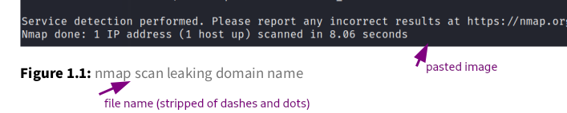
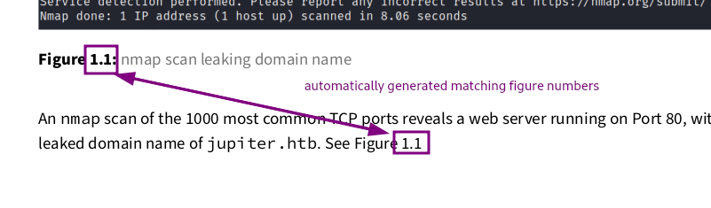

# Overview
This is a fork of [noraj/OSCP-Exam-Report-Template-Markdown](https://github.com/noraj/OSCP-Exam-Report-Template-Markdown). 

The goal is to help streamline report writing during labs/pentesting, by reducing the number of "passes" needed to create the report.  

The idea is that you can take your notes organically during the test, and with some minimal editing, quickly assemble your text into a clean, professional looking report with 

* an automatically generated title page
* an automatically generated table of contents
* automatically generated image labels
* automatically generated references to figures within the document
* automatically generated chapter/heading/section/subsection numbers

This project makes use of the [Obsidian Markdown Editor](https://obsidian.md),  [The Eisvogel LaTeX template](https://github.com/Wandmalfarbe/pandoc-latex-template#installation),  [`pandoc`](https://pandoc.org/installing.html), and some custom scripts to help save you time writing reports.

## Intent
The intent for this repo is for it to be used as a "starter" for reporting on tests, labs, etc.  This was designed for the Obsidian Markdown editor in order to take advantage of some of the native features as well as community plugins.

The `.obsidian` folder is included in this repo, so you should have all the plugins and settings enabled from the get-go.  Please make whatever adjustments you need to work comfortably.

# Requirements
## Important Note

This is intended for use only on Linux.  I have not tested this on Windows, and I am not planning to any time soon.  If you'd like to be a guinea pig, feel free to fork and submit a pull request!

## Software
- [Obsidian Markdown Editor](https://obsidian.md) , with the following plugins:
    * Paste image rename plugin (included in this repo)
    * Obsidian Link Converter plugin (included in this repo)
    * Obsidian Heading Shifter plugin (included in this repo)
- [`pandoc`](https://pandoc.org/installing.html)
- [The Eisvogel LaTeX template](https://github.com/Wandmalfarbe/pandoc-latex-template#installation)
* LaTeX/TeXlive - see below
* `awk` - should come standard with Linux distro

### Obsidian plugin breakdown

| plugin name | what it does | why it's needed | 
| --- | --- | --- |
| Paste Image Rename | Renames images as they're pasted into the project. | better attachment organization; image filenames become captions in report |
| Obsidian Link Converter | ensures links are CommonMark markdown spec with relative paths | Pandoc only recognizes CommonMark link formats. Also makes it trivially easy to convert older notes you may have with Wiki style links (`![[some link]]`) |
| Obsidian Heading Shifter | quickly promotes/demotes Markdown headers | Allows you to quickly promote and demote headings in an extracted section to match what they need to be in the final report |


### Minimum LaTeX installation

A full LaTeX installation is 1GB+, so if space is tight (or you just don't want bloat), this is the minimum set of packages you need to get off the ground.

```bash
apt install texlive-base texlive-binaries \
    texlive-fonts-extra texlive-fonts-extra-links \
    texlive-fonts-recommended texlive-latex-base \
    texlive-latex-extra texlive-latex-recommended \
    texlive-pictures texlive-plain-generic
```

# Installation
1. Ensure you have all the required software and plugins listed above. 
2. Clone this repo. 
3. In Obsidian, open this repo as a vault.
4. Start taking notes!

## Optional - version control

After cloning, remove the `.git` directory from the root of the repo.  Then, to create a new repository, run the commands below:

```bash
# initializes a new git session in the current directory
# with the default branch 'main'
git init -b main
```

Now you have version history, and you can back up your personal fork of this repo to any of the popular Git hosting services, e.g. GitLab, GitHub, your own private git server, etc.

# Configuration
This is a sampling of some of the configuration settings in this repo.  This list is not comprehensive, and you can totally adjust anything you like to fit your needs.

* `vim` keybindings
* line numbers
* images/attachments are stored in `./img`
* [suggested Heading Shifter hotkeys](https://github.com/k4a-l/obsidian-heading-shifter#features)

## `templates/frontmatter.yml`

This file contains the metadata that populates the Title, Subtitle, Date, etc. fields in the report.  Simply update this file with your information and it will automatically appear in the report.

Alternatively, you can specify a custom frontmatter file with the `-y` flag.

# Suggested Usage
## Take notes
Take your notes in markdown, however you like.

## Organize the flow of the report
I'll start by saying there's no wrong way to do this.  But what's attractive about Obsidian to me is that it's very easy to "extract" selections from one file into a whole new file.

Why is this so useful?  Because then we can arrange these files in the order we want them to appear in the report, concatenate them all together, and run them all through Pandoc (in order!) fairly easily with some rudimentary bash-foo.

### Example 1 - Sequential filenames

As I'm extracting files, I"ll be prompted to rename them.  I can prepend each file name with, for example, a two-digit number representing the order I want to see this content in.  For example, suppose I have the following files in my working directory that I want to appear in this exact order in the report:

```bash
ls {00..99}*.md
'00 - Enumeration.md'
'011 - gobuster results.md'
'01 - web server home page.md'
'02 - Subdomain kiosk.md'
'03 - sql injection.md'
'04 - foothold with sql injection.md'
'05 - more ports.md'
'06 - users with shell access.md'
'07 - Pivot to juno user.md'
'08 - network shadow simulator.md'
'09 - user flag.md'
'10 - SSH port forwarding - investigating other listening services.md'
'11 - other services.md'
'12 - jupyter notebook.md'
'13 - reverse shell as jovian.md'
'14 - root flag.md'
```

In the command above, the `{00..99}*.md`  represents a [bash pathname expansion](https://www.gnu.org/savannah-checkouts/gnu/bash/manual/bash.html#Filename-Expansion) which reliably and predictably lists these files in the order they appear in this list:
- `{00..99}` - this is the same as `seq 00 99`; that is, the list of two-digit integers from `00` to `99`
- `*` - expands to all matching patterns.

So, for example, `00*.md` means "all filenames starting `00` followed by zero or more characters of any type followed by `.md`", which just so happens to be `00 - Enumeration.md` in this case.

Suppose you've worked all the way through `12`, but you've discovered you'd really like to add something between `00` and `01`.  You might have noticed that the list above includes a `011`.  This number holds no special meaning other than pathname expansion will always put it between `00` and `01`. 

### Example 2 - a file containing a list of filenames

Another approach could be to maintain a file which contains a list of the files you want to go in the report, in the order in which you want them to appear:
```
# files.txt
Enumeration.md
gobuster-results.md
web-server-home-page.md
Subdomain-kiosk.md
sql-injection.md
foothold-with-sql-injection.md
more-ports.md
users-with-shell-access.md
Pivot-to-juno-user.md
network-shadow-simulator.md
user-flag.md
SSH-port-forwarding---investigating-other-listening-services.md
other-services.md
jupyter-notebook.md
reverse-shell-as-jovian.md
root-flag.md
```

This file achieves the same purpose as the pathname expansion in the previous section, with the advantage of being perhaps a little more explicit.  Either way, the result is the same - this list of files will be passed in this order for rendering by Pandoc.

## Generate the report

### Manually generating the report - Beta version

The code in this section will eventually find its way into the `generate.sh` script, but for now please use these commands to generate the report manually.

```bash
# replace the date in frontmatter.yml with today's date
today=$(date +%F)
sed -ri "s/(date: \")([^\"])\"/\1${today}/" templates/frontmatter.yml

# replace '*.md' with whatever expands to the list you want
files=(templates/frontmatter.yml *.md)
cat ${files} \
    | awk -f prepare.awk - \
    | pandoc - -o ./test.pdf \
         --from markdown+yaml_metadata_block+raw_html \
         --template eisvogel \
         --table-of-contents \
         --toc-depth 6 \
         --number-sections \
         --top-level-division=chapter \
         --highlight-style breezedark
```
 
### FOR FUTURE RELEASE - NOT CURRENTLY WORKING
Just sketching out the script here - will implement later.
```bash
./generate.sh [-p] [-f LIST] [-o PDF] FILE1 [FILE2 FILE3 ...]

    Process and pass FILE(s) to pandoc for rendering into a report 
    with the Eisvogel LaTeX template. FILEs are processed in the 
    order in which they appear in the list.

    -p          preview: renders the markdown that will be passed
                to pandoc; opens in pager

    -f LIST     a file containing the list of files to process
                in the order in which they should appear in the
                report; see README

    -o PDF      specify output file name with extension
                default is report.pdf

```

# How do I ...

## ...use Markdown if I'm not very familiar with it?

Obsidian ships with a read-only "Sandbox Vault" - this is a handy reference to have open as you write or edit your notes.

## ...get my name and stuff on the report?

Provided in this repo is the file `templates/frontmatter.yml`.  Simply update the relevant sections with your information, and it will appear in the report.

## ...do the automatic image labeling?

When you paste an image into Obsidian, the Paste Image Rename plugin prompts you for a filename for the image.  Whatever you put as the filename will become the label/caption for that image in the report.

As long as you choose descriptive names for the images you paste into your notes, the caption will automatically populate in the report.

For example, suppose you paste an image and rename it to `nmap-scan-leaking-domain-name.png`.  When the report is rendered, you'll see this:



## ...automatically reference images in the report?

As you're writing your report, you may want to refer to specific images/figures, but there's no way to be sure how it will be labeled (e.g. Figure 2.1) until the report is generated.

By adding `\label{someLabel}` to the alt-text part of the embed link -- that is, the text between the square brackets -- you can refer back to that figure in the text of the report with `\ref{someLabel}`, and Pandoc will take care of the rest.

For example, suppose your markdown notes contain the following embed link:

```markdown


```

If you'd like to refer back to this figure later in your markdown, simply write

```markdown
See Figure \ref{someUniqueLabel}
```

The rendered report will look like this:



## ...do something not covered here?

I've included the [FAQ](FAQ.md) from the original project.  If something you want to do isn't covered here, submit an issue and we'll try and figure it out!

# To Do
- [x] incorporate automatic references to images?
- [ ] scripts
    - [ ] generate report
        - [ ] gather files: frontmatter, md
            - [ ] pass in a list of files to be processed in the order in which they're passed in
            - [ ] pass in a file containing a list of the files to be processed in that order
        - [ ] render/preview markdown document
- [ ] frontmatter
    - [ ] ~~automatically include frontmatter in new notes (for image rename)~~ handle in script - should be first file in list of files
    - [x] determine what maps to where from frontmatter -> report
        - [ ] make frontmatter template