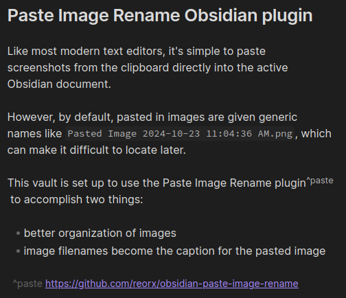
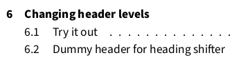
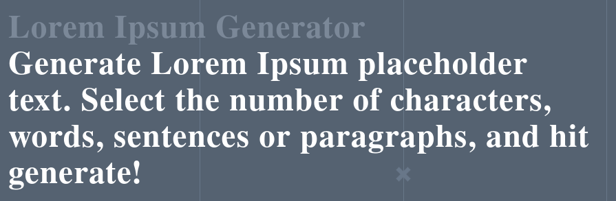

# Getting started

This is a sample document to illustrate some of the things you can do.  Use this to play around and test some of the things you can do with this tool.

To render the report and see your changes as you go, use the commands below.

```bash
# clone this repo
git clone https://github.com/colebaty/auto-reporting.git
cd auto-reporting

# render the report
./generate.sh 'Try it out.md'
```

# Frontmatter

At the beginning of the source of this document there is some "frontmatter".  This is a YAML block with information that will be rendered in the document:

- Title: self explanatory
- lof: "list of figures".  when set to "true", a page appears after the table of contents with a list of the figures included in the document
- lot: "list of tables", like the list of figures, but for tables instead.

# Linking/referencing images, tables, etc.

Use `\label{some-label]` and `\\ref{some-label}` pairs to "link" items together so that Pandoc can track them and generate labels automatically when the report is rendered.  This will also ensure they populate in the "List of Tables" or "List of Figures" page, if these will be included in the report.

## Paste Image Rename Obsidian plugin

Like most modern text editors, it's simple to paste screenshots from the clipboard directly into the active Obsidian document.

However, by default, pasted in images are given generic names like `Pasted Image 2024-10-23 11:04:36 AM.png`, which can make it difficult to locate later.

This vault is set up to use the Paste Image Rename plugin[^paste] to accomplish two things:

- better organization of images
- image filenames become the caption for the pasted image

[^paste]: https://github.com/reorx/obsidian-paste-image-rename



Figure \\\\ref{paste-image-rename}, above, shows an example of a screenshot taken from this source document, renamed as `This-image-was-renamed-with-the-paste-image-rename-plugin.png`.  In the rendered document, this image will have the caption "This image was renamed with the paste image rename plugin", and the figure number is automatically generated with the `\\label` and `\\\\ref{}` tags mentioned earlier.

### Try it out!

\[REPLACE THIS WITH A PASTED IMAGE\]

## Link formatting

In order for images to populate properly, the links must be in CommonMark spec:

```markdown
# commonmark spec with absolute path - compatible


# wiki spec with relative path - incompatible
![[../to/img.png | alt text]]
```

Additionally, the path to the images must be absolute with respect to the root of the vault.

The Obsidian Link Converter plugin[^link-converter] takes care of this.  This vault is set up so that all links should automatically be the correct format, but in case something gets messed up, all you need to do is select the three dots in the upper right of the editor, and choose:

- WikiLinks to Markdown
- All Links to Absolute Path

[^link-converter]:https://github.com/ozntel/obsidian-link-converter


## Tables

Tables in Markdown can be...well, cumbersome.  Luckily, recent Obsidian releases have incorporated more and more table functionality.  Creating and editing tables in Obsidian is now very similar to inserting a table into something like a Word or Google Sheets document.

Table: Obsidian plugin breakdown  \label{table-plugin} 

| plugin name                   | what it does                                                   | why it's needed                                                                                                                                           |
| ----------------------------- | -------------------------------------------------------------- | --------------------------------------------------------------------------------------------------------------------------------------------------------- |
| Paste Image Rename            | Renames images as they're pasted into the project.             | better attachment organization; image filenames become captions in report                                                                                 |
| Obsidian Link Converter       | ensures links are CommonMark markdown spec with relative paths | Pandoc only recognizes CommonMark link formats. Also makes it trivially easy to convert older notes you may have with Wiki style links (`![[some link]]`) |
| Obsidian Heading Shifter      | quickly promotes/demotes Markdown headers                      | Allows you to quickly promote and demote headings in an extracted section to match what they need to be in the final report<br>                           |
| Obsidian Text Snippets Plugin | quickly generate frequently used LaTeX commands                | Quickly generate link-ref pairs, and any other text you find yourself typing over and over                                                                |


Table \\\\ref{table-plugin} duplicates the "Obsidian plugin breakdown" table from the README document.  

Try it out below!

### Try it out!

\[CREATE A NEW TABLE HERE. TRY ADDING A LABEL-REFERENCE PAIR\]

# Common Markdown techniques

The advantage of using Markdown over a more traditional WYSIWYG editor comes with technical writing.  It's much easier to quote code blocks, and Obsidian ships with MathJax[^mathjax], so LaTeX equations render right in the editor, and will also render in the document:

[^mathjax]: https://www.mathjax.org/

$$
\sum_{i=0}^{n}{a^{i}}
$$


## Inline code and code blocks

Inline code is useful for distinguishing things like variable names among the other printed text. To make inline code, simply place the text inside a pair of backticks, e.g. \``some inline code`\`

Code blocks are useful for preserving formatting and syntax highlighting from source code or shell commands you may be referencing.  To begin a code block, just type three consecutive backticks (\`), optionally followed by the name of the language.[^prism] 

For example, to quote the `log()` function from the `generate.sh` script:

```bash
# prints only if invoked with -v
# usage: log <string> [color = BLUE]
function log() {
    COLOR=${BLUE}
    [[ $# -eq 2 ]] && COLOR=$2
    [[ -v DEBUG ]] \
        && echo -e "$COLOR[+]$NONE $1" >&2
}
```


[^prism]: Obsidian natively supports Prism.js syntax highlighting: https://prismjs.com/#supported-languages


# Changing title pages

The default frontmatter is located at `templates/frontmatter.yml`. Using the `-y` flag, you can specify a custom frontmatter file with additional information.

## Try it out

Add a logo to the title page, and change its background color by running the following command to generate the report:

```bash
./generate.sh -y templates/frontmatter-with-custom-logo.yml 'Try it out.md'
```

This will add the ODU logo to the title page of the document, as well as change the page background to "ODU blue".  


# Changing header levels

While composing the report, you may determine that a given section should be promoted (by removing `#`s from the header), or demoted (by adding `#`s).  

This is quickly accomplished by using the Obsidian Heading Shifter plugin[^shifter]. 

[^shifter]: https://github.com/k4a-l/obsidian-heading-shifter


To use, simply select the text containing the header you wish to promote/demote, and then type `Ctrl+Left` to promote, or `Ctrl-Right` to demote, where `Left` and `Right` are your keyboard's left and right arrow keys.

## Try it out

The heading below should be on the same level as this one.  Use the Heading Shifter plugin to promote it so that it looks like what's shown below in the screenshot of the table of contents (Fig. \\\\ref{toc}).



##### Dummy header for heading shifter

Lorem ipsum dolor sit amet, consectetur adipiscing elit, sed do eiusmod tempor incididunt ut labore et dolore magna aliqua. Ut enim ad minim veniam, quis nostrud exercitation ullamco laboris nisi ut aliquip ex ea commodo consequat. Duis aute irure dolor in reprehenderit in voluptate velit esse cillum dolore eu fugiat nulla pariatur. Excepteur sint occaecat cupidatat non proident, sunt in culpa qui officia deserunt mollit anim id est laborum.


# Appendix A: Appendices {-}

Sometimes, you'll want to include one or more appendices.  By including the `{-}` at the end of the heading, you'll ensure these don't get numbered chapters.  Images and tables referenced in these sections will still have "chapter" numbers, but they will be internally consistent.

# Appendix B: Try it out

The heading for this appendix is missing the `{-}` at the end of the line.  Render the document with and without it and notice the difference.


# Appendix C: Dummy appendix

Lorem ipsum dolor sit amet, consectetur adipiscing elit, sed do eiusmod tempor incididunt ut labore et dolore magna aliqua. Ipsum consequat nisl vel pretium lectus quam id leo. Lacus luctus accumsan tortor posuere ac. Suspendisse in est ante in nibh mauris. Laoreet id donec ultrices tincidunt arcu non. Massa vitae tortor condimentum lacinia. Euismod elementum nisi quis eleifend. Quisque id diam vel quam elementum. Id eu nisl nunc mi ipsum faucibus. Sed vulputate odio ut enim blandit. Sit amet tellus cras adipiscing enim eu turpis egestas. Aliquet risus feugiat in ante metus dictum at tempor. Sit amet massa vitae tortor condimentum lacinia quis vel. Senectus et netus et malesuada fames. Habitant morbi tristique senectus et netus et. Odio ut sem nulla pharetra diam sit. Fermentum iaculis eu non diam phasellus vestibulum lorem sed. Tempor orci eu lobortis elementum nibh tellus molestie nunc non.

Egestas sed sed risus pretium. Eget aliquet nibh praesent tristique magna. A diam sollicitudin tempor id. Est pellentesque elit ullamcorper dignissim cras tincidunt lobortis feugiat vivamus. Sed risus ultricies tristique nulla aliquet. Ut tristique et egestas quis ipsum suspendisse ultrices. Blandit volutpat maecenas volutpat blandit aliquam etiam erat. Id aliquet lectus proin nibh nisl condimentum id. Enim facilisis gravida neque convallis a cras semper. Eget dolor morbi non arcu risus quis. Pellentesque habitant morbi tristique senectus et netus. Amet venenatis urna cursus eget nunc. Eleifend donec pretium vulputate sapien nec sagittis.

Tellus orci ac auctor augue mauris. Malesuada fames ac turpis egestas. Cursus in hac habitasse platea dictumst quisque sagittis purus sit. Non curabitur gravida arcu ac tortor dignissim convallis. Quis imperdiet massa tincidunt nunc. Proin nibh nisl condimentum id venenatis a. Vitae congue mauris rhoncus aenean vel elit scelerisque. Leo duis ut diam quam nulla. Rhoncus mattis rhoncus urna neque viverra justo nec. Vestibulum lectus mauris ultrices eros in cursus turpis massa. Eu ultrices vitae auctor eu augue ut lectus arcu.

Nisi est sit amet facilisis magna etiam tempor orci. Eu ultrices vitae auctor eu. Sed id semper risus in hendrerit gravida rutrum. Aliquet bibendum enim facilisis gravida neque convallis. Nulla facilisi nullam vehicula ipsum a arcu cursus vitae congue. Diam sit amet nisl suscipit adipiscing bibendum. Nec sagittis aliquam malesuada bibendum arcu vitae elementum curabitur. Nec feugiat in fermentum posuere urna nec tincidunt praesent. Id donec ultrices tincidunt arcu. Dolor purus non enim praesent elementum facilisis leo. Nulla pharetra diam sit amet nisl suscipit adipiscing. Neque aliquam vestibulum morbi blandit cursus. Pharetra diam sit amet nisl. Vel elit scelerisque mauris pellentesque pulvinar pellentesque.

Eleifend donec pretium vulputate sapien. Nulla at volutpat diam ut venenatis tellus in metus. Mauris commodo quis imperdiet massa tincidunt nunc. Id aliquet lectus proin nibh nisl condimentum id venenatis a. Pellentesque habitant morbi tristique senectus et netus et. Fames ac turpis egestas maecenas pharetra convallis posuere. A diam sollicitudin tempor id eu nisl nunc mi ipsum. Dolor sed viverra ipsum nunc aliquet bibendum. Quam viverra orci sagittis eu. Commodo sed egestas egestas fringilla phasellus. Maecenas ultricies mi eget mauris. Viverra tellus in hac habitasse platea dictumst vestibulum rhoncus. Nam libero justo laoreet sit amet cursus. Pellentesque id nibh tortor id aliquet lectus proin. Mattis ullamcorper velit sed ullamcorper morbi tincidunt. Non nisi est sit amet facilisis.

# Appendix D: Another dummy appendix, with images {-}





Lorem ipsum dolor sit amet, consectetur adipiscing elit, sed do eiusmod tempor incididunt ut labore et dolore magna aliqua. Magna ac placerat vestibulum lectus mauris ultrices eros in cursus. Neque vitae tempus quam pellentesque nec nam. Leo in vitae turpis massa. Est velit egestas dui id ornare arcu odio. Porta lorem mollis aliquam ut. Viverra vitae congue eu consequat ac felis. Elementum tempus egestas sed sed. Faucibus nisl tincidunt eget nullam non nisi est sit amet. Scelerisque fermentum dui faucibus in. Facilisi nullam vehicula ipsum a. Rhoncus dolor purus non enim praesent elementum facilisis. Quisque egestas diam in arcu cursus euismod quis viverra nibh. Erat nam at lectus urna duis. Amet mattis vulputate enim nulla. Pulvinar pellentesque habitant morbi tristique senectus et netus. Risus quis varius quam quisque id. Leo integer malesuada nunc vel risus commodo viverra. At elementum eu facilisis sed odio morbi quis. Lacus vel facilisis volutpat est velit egestas.

Sed nisi lacus sed viverra tellus in hac habitasse. Eget lorem dolor sed viverra ipsum nunc aliquet bibendum enim. Elit sed vulputate mi sit amet. Vitae justo eget magna fermentum iaculis eu non diam phasellus. Felis bibendum ut tristique et. Aliquam nulla facilisi cras fermentum odio eu feugiat. Lectus quam id leo in. Id velit ut tortor pretium viverra suspendisse potenti. Odio ut sem nulla pharetra diam sit amet nisl suscipit. Risus nec feugiat in fermentum posuere urna nec tincidunt. Pretium fusce id velit ut tortor pretium. Consectetur adipiscing elit duis tristique sollicitudin nibh sit. Vitae elementum curabitur vitae nunc sed velit dignissim. A arcu cursus vitae congue mauris.

In iaculis nunc sed augue lacus viverra. Tellus in metus vulputate eu scelerisque. Amet tellus cras adipiscing enim eu turpis egestas pretium. Vivamus arcu felis bibendum ut tristique et egestas. Scelerisque felis imperdiet proin fermentum leo vel. Leo vel orci porta non pulvinar neque laoreet. Fringilla ut morbi tincidunt augue interdum. Augue lacus viverra vitae congue eu consequat ac felis donec. Leo duis ut diam quam nulla porttitor. Mi bibendum neque egestas congue quisque egestas diam. Et netus et malesuada fames ac turpis. Dictumst quisque sagittis purus sit amet volutpat. Sodales ut etiam sit amet nisl purus in. Scelerisque eleifend donec pretium vulputate sapien. Nunc congue nisi vitae suscipit tellus.

Volutpat ac tincidunt vitae semper quis lectus. Ac tortor dignissim convallis aenean et tortor at risus viverra. Aliquam etiam erat velit scelerisque in dictum non consectetur a. Et netus et malesuada fames ac turpis egestas. Quisque id diam vel quam. Nascetur ridiculus mus mauris vitae ultricies leo integer. At risus viverra adipiscing at in tellus integer. Placerat duis ultricies lacus sed turpis tincidunt. Elit ut aliquam purus sit. Est ullamcorper eget nulla facilisi etiam dignissim diam quis. Tortor id aliquet lectus proin nibh nisl condimentum id. Lectus arcu bibendum at varius vel pharetra vel turpis nunc. A iaculis at erat pellentesque adipiscing commodo. Tristique senectus et netus et malesuada fames ac turpis egestas. Id cursus metus aliquam eleifend mi in nulla posuere. Fermentum odio eu feugiat pretium nibh. Donec ac odio tempor orci dapibus ultrices in iaculis nunc. Ornare massa eget egestas purus viverra accumsan in nisl.

Elementum facilisis leo vel fringilla est ullamcorper eget. Condimentum lacinia quis vel eros donec ac odio tempor orci. Ut consequat semper viverra nam libero justo laoreet sit. Sit amet facilisis magna etiam tempor orci eu. Vitae justo eget magna fermentum iaculis. Vestibulum lectus mauris ultrices eros. Metus vulputate eu scelerisque felis imperdiet proin fermentum leo vel. Lobortis elementum nibh tellus molestie nunc non blandit. Facilisis gravida neque convallis a cras. Enim neque volutpat ac tincidunt vitae semper quis.

