---
# pandoc settings
title: "Penetration Test Report"
author: "0xe10c@hack.me"
date: "2020-07-25"
subject: "Markdown"
keywords: [Markdown, Example]
subtitle: "[subtitle]"
lang: "en"
titlepage: true
titlepage-color: "1E90FF"
titlepage-text-color: "FFFAFA"
titlepage-rule-color: "FFFAFA"
titlepage-rule-height: 2
book: true
book-class: false
classoption: oneside
code-block-font-size: \scriptsize

# image rename settings
imageNameKey: replace-me
---


# Executive Summary

Lorem ipsum dolor sit amet, consectetur adipiscing elit, sed do eiusmod tempor incididunt ut labore et dolore magna aliqua. Tortor at auctor urna nunc id cursus. Sed vulputate mi sit amet mauris commodo. In ante metus dictum at tempor commodo ullamcorper a lacus. Suspendisse faucibus interdum posuere lorem ipsum dolor.

# Report


## Enumeration


### TCP services - common

```bash
nmap -sC -sV -oA nmap/jupiter 10.10.11.216 # scan for top 1000 default ports
```


An `nmap` scan of the 1000 most common TCP ports reveals a web server running on Port 80, with a leaked domain name of `jupiter.htb`.
Accessing the website, it's a web sever hosting information about space.


## Subdomain: kiosk.jupiter.htb


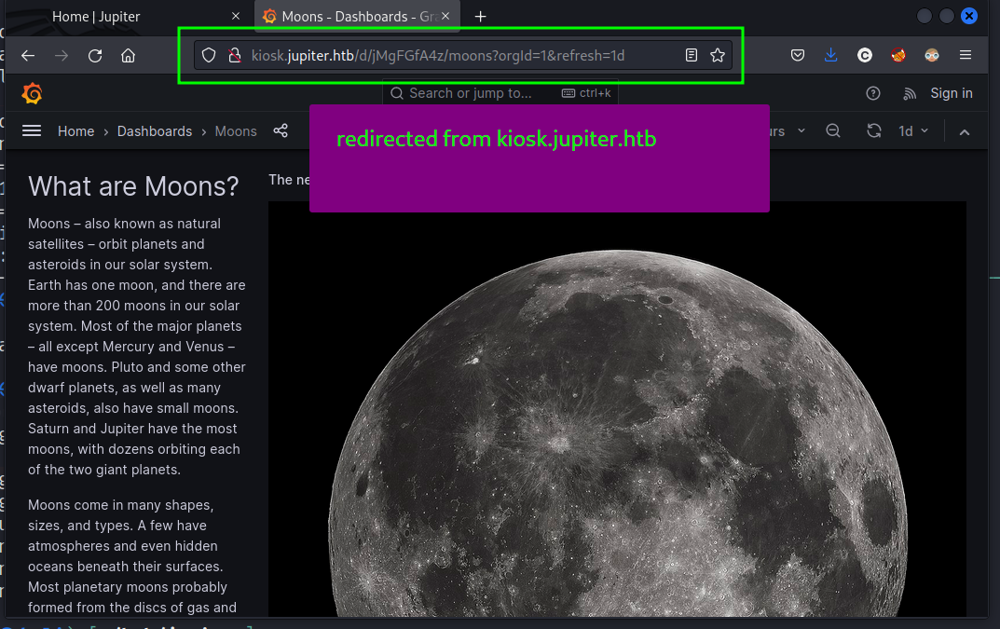


Accessing `kiosk.jupiter.htb`, there is a rapid succession of redirects, landing on the page shown above.  Scrolling down the page, information populates dynamically on the page suggesting the use of a back-end database.Examining the requests, eventually we find a POST request to the `/api/ds/query` API endpoint, transmitting JSON data with a field named `rawSql`, which is vulnerable to SQL injection.


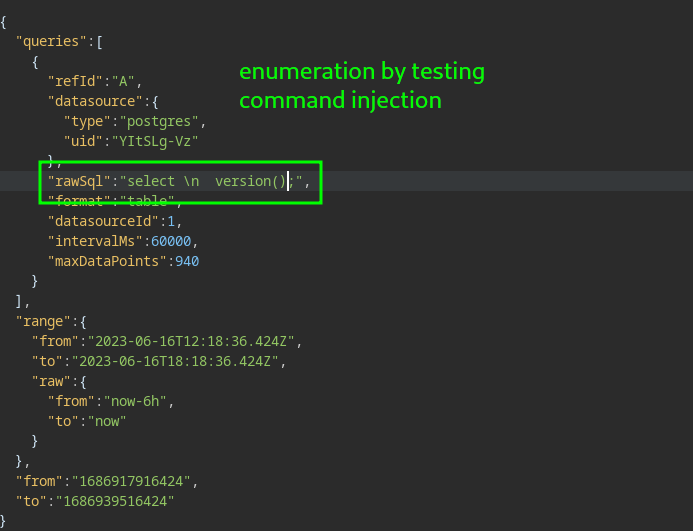


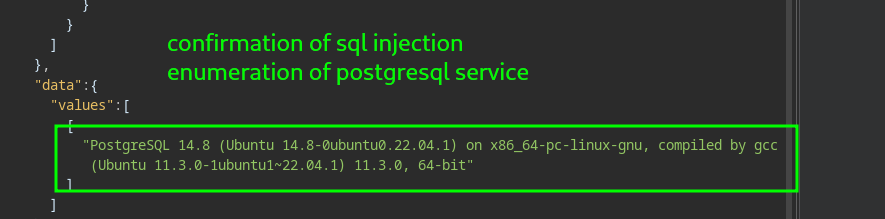


## Initial Foothold: `sqlmap --os-shell`


Using the saved request, we can gain a rudimentary web shell with the command `sqlmap --os-shell` as the `postgres` user.  This is a low-privilege user who has read/write access on the system, as well as networking.

Using this web shell, transitioned to a more traditional reverse shell, enabling persistence through the use of the `cron` scheduling utility to send a reverse shell back to the attacking machine once every minute.#### more ports
The command `ss -ltp` reveals a few listening ports which did not show up in the nmap scan.  


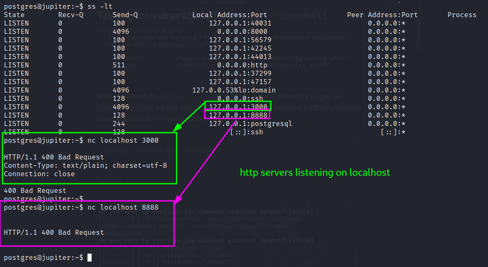


### users with shell access


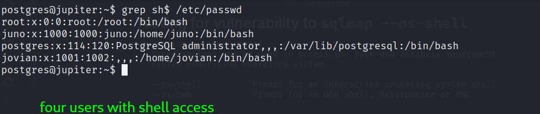


We can see in the `/etc/passwd` file there are four users on the target with shell access:
* `root`
* `postgres`
* `juno`
* `jovian`

## Pivot to `juno` user


`juno` belongs to the groups `juno` and `science`.  


### files owned by `juno` user

Using the command below, we discovered a number of files owned by the `juno` user in the `/dev/shm` directory.

```bash
find / -user juno -type f -ls 2>/dev/null
```


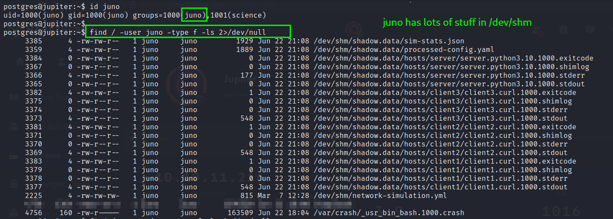


These files pertain to the Shadow Network Simulator.


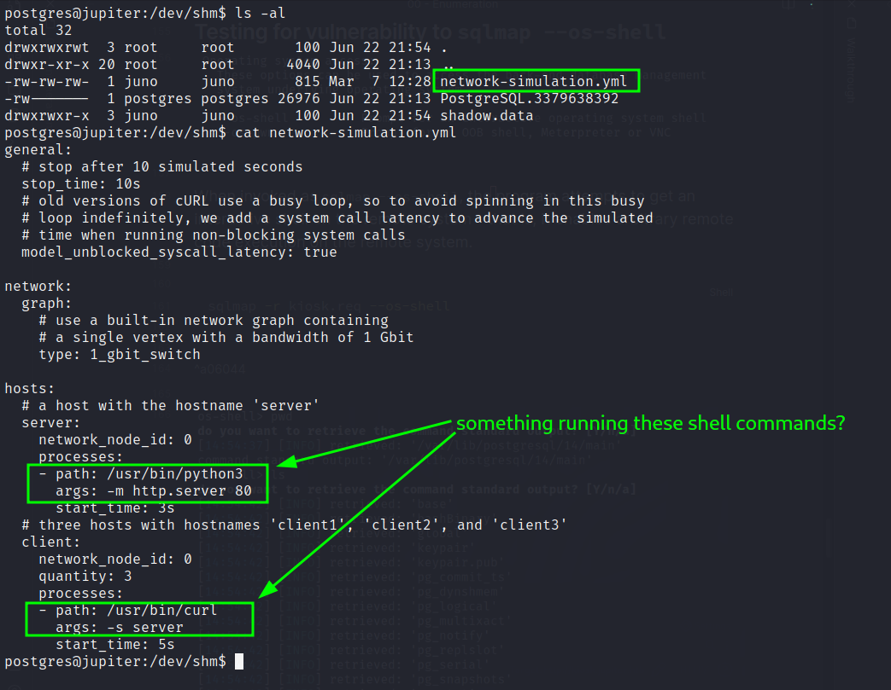


Searching the internet for "shadow network simulation", we eventually come to [this page](https://shadow.github.io/docs/guide/security.html) describing the "non security" of the Shadow Network simulation tool:

>Shadow currently doesn't restrict access to the host file system. A malicious managed program can read and modify the same files that Shadow itself can.

This configuration file can be abused to gain code execution as the `juno` user through the use of a copy of `bash` with the SUID bit set.

With this shell, we can manipulate `juno`'s SSH settings to gain a full shell as the `juno` user, and find the user flag.#### user flag

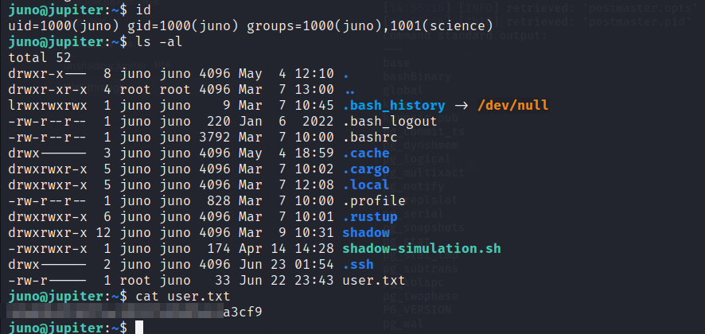


## SSH port forwarding - investigating other listening services


We can use SSH port forwarding to access the other ports on the machine.

### Port 3000


Port 3000 is serving the `jupiter.htb` website.


### Port 8888


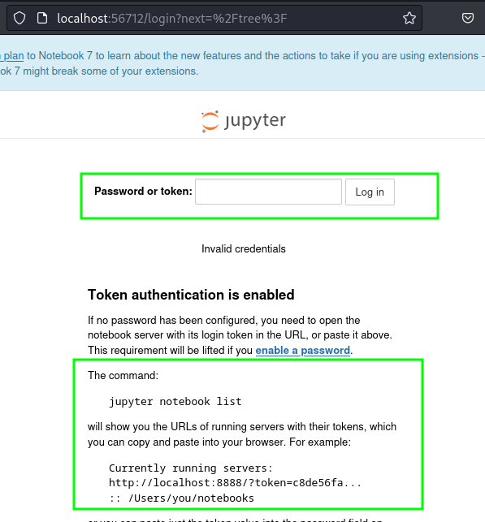

As `juno`, attempts to use the `jupyter notebook list` command fail:

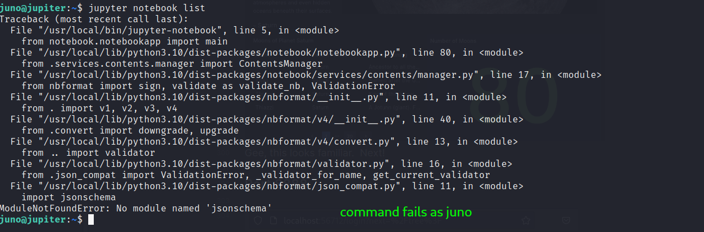


If we look to see which processes are running under `jovian`, we can see a Python call associated with the Jupyter Notebook instance, running out of `/opt/solar-flares/`.


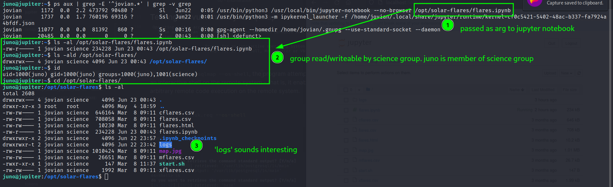

The argument passed to Jupyter is group read/writable by members of the `science` group, which includes `juno`.  The `logs` directory in this folder contains many log files dating back months.  Examining them exposes tokens used to access the Jupyter notebook instance.


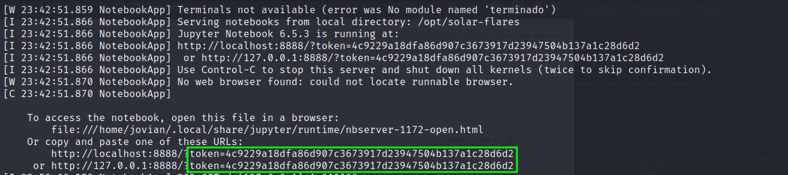


Supplying a token to the Jupyter notebook allows us to gain code execution as the `jovian` user and send a reverse shell back to the attacker.

## reverse shell as `jovian`


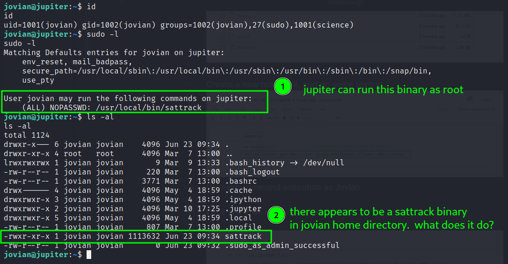


User `jovian` can run the binary `/usr/local/bin/sattrack` with root privileges, without the need to supply a password.


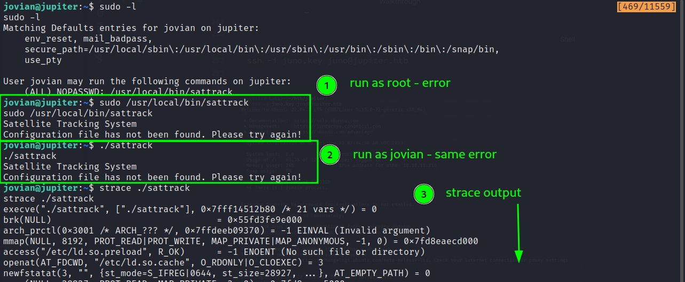


We get the same error when we run as root and as `jovian` - complaining about some config file not being found. Using `strace` we see that the program can't open the file `/tmp/config.json`.


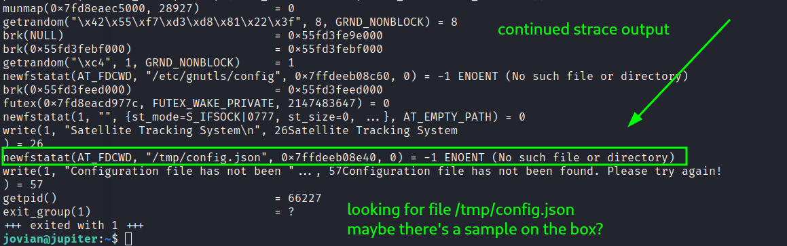

## Root Flag

When supplied with the file `/tmp/config.json`, the `sattrack` binary creates the `/tmp/tle` directory and writes to it.  We can abuse the URI in the `tlesources` section to get local file inclusion (LIF) as `root`, and read the root flag `/root/root.txt`.

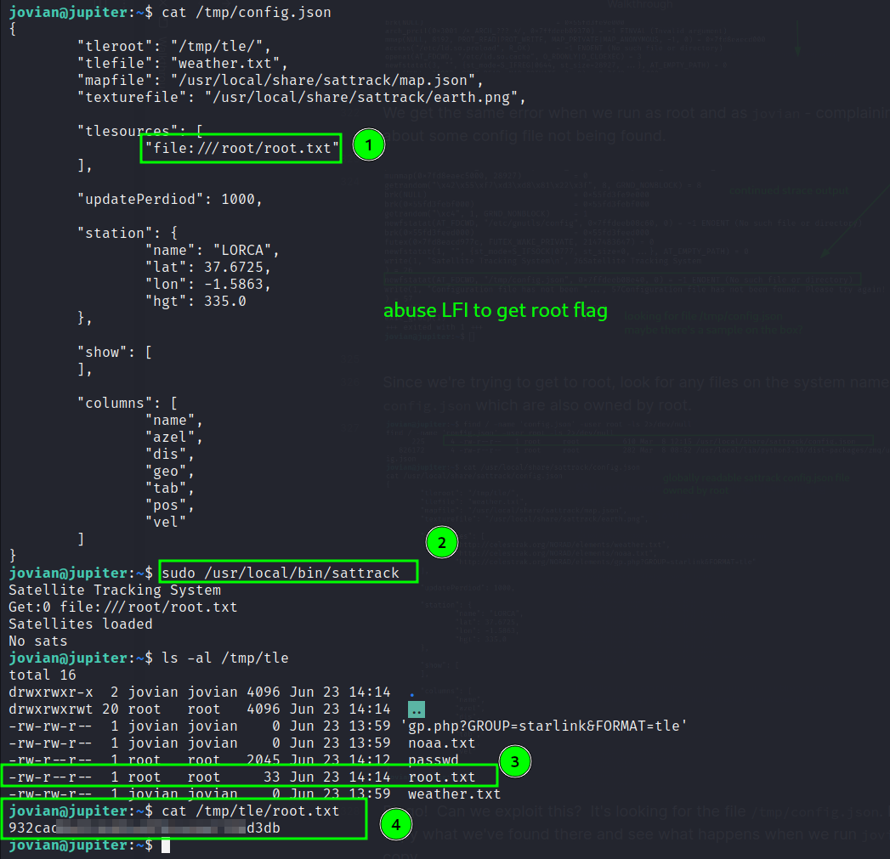

