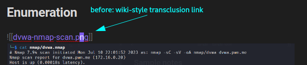
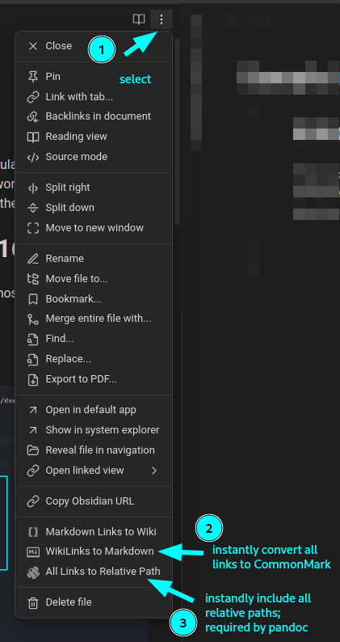
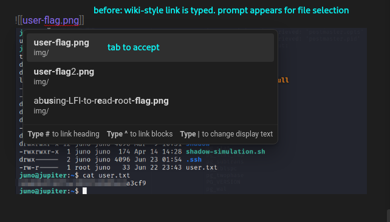
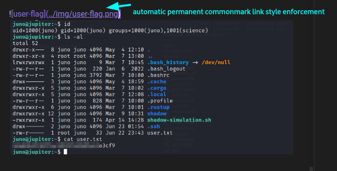
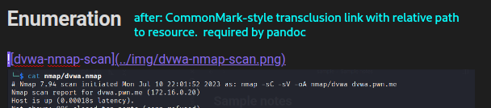

# Enforcing Pandoc link requirements with Obsidian Link Converter plugin

Pandoc [requires links to be formatted a certain way](https://github.com/noraj/OSCP-Exam-Report-Template-Markdown/issues/47). The Obsidian Link Converter plugin (included in this repo) will automatically and permanently enforce the required CommonMark link specification.

This is useful for "importing" older, existing notes taken in Markdown, such as notes from another Obsidian vault.

## Before

## Use Obsidian Link Converter 

1. Choose the three dots at the top-right of the open document
2. Instantly convert all links in the document to CommonMark spec links `` . This is "permanent" until you change it:
### before

### after

## After

# Extracting notes into separate files
