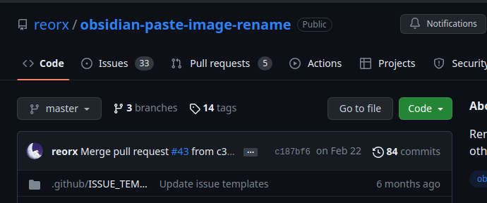

good progress with this

# TODO
- [ ] you have to set the obsidian environment up to
    - [ ] use "markdown" links for pasted images, not "wiki" links


- [ ] use a [plugin](https://forum.obsidian.md/t/paste-image-rename-plugin/35480) to help name files properly to eliminate the spaces




 this will make the awk script a lot easier, i suspect

- [ ] writing/formatting
    - [ ] all \# headers, and links to images should appear on their own lines, i.e. separated by newlines

```markdown
##### BAD #####

# some header


##### GOOD #####

# some header <- on its own line

 <- on its own line
```

- [ ] does resizing work with markdown tags?
